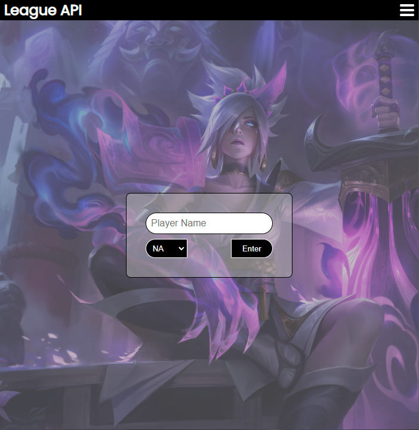

# League of Legends API

This application allows users to search for and view information about League of Legends player games using the Riot Games API.

## Getting Started

These instructions will get you a copy of the project up and running on your local machine for development and testing purposes.

## Prerequisites

- Node.js
- A Riot API key (sign up for one [here](https://developer.riotgames.com/))

## Installing

1. Clone the repository: `git clone https://github.com/TyeStanley/league-of-legends-api`

2. Install the dependencies: `npm install`

3. Create a `.env` file in the server directory and add your Riot API key: `RIOT_API_KEY=[YOUR API KEY HERE]`

4. Start the development server: `npm run develop`

The application will now be running at `http://localhost:3000/`.

## Built With

- <ins>**React**</ins> - JavaScript library for building user interfaces
- <ins>**Express**</ins> - Web framework for Node.js
- <ins>**Riot Games</ins> API** - API for accessing League of Legends data

## Images

## Author

Tye Stanley - [Portfolio](https://tyestanley.herokuapp.com/) - [Linkedin](https://www.linkedin.com/in/tye-stanley) - [GitHub](https://github.com/TyeStanley)

I am a software developer with a passion for creating user-friendly and efficient
applications. I have experience in MERN Stack(MongoDB, Express, React, Node).

I have been an avid player of League of Legends for over a decade, and saw the creation of
this project as an opportunity to utilize my skills as a software developer to benefit
myself and my fellow players. The goal of this project is to provide a valuable resource
for gathering and analyzing data that can be used to improve gameplay strategies and
decision making. It is my hope that this project will serve as a long-term tool for myself
and the League of Legends community.

Feel free to reach out to me via my [website](https://tyestanley.herokuapp.com/) or
[linkedin](https://www.linkedin.com/in/tye-stanley/) if you have any questions or
suggestions! I am always looking to improve and expand upon my work.

## License

This project is licensed under the MIT License - see the [<ins>**LICENSE**</ins>](./LICENSE) file for details.
